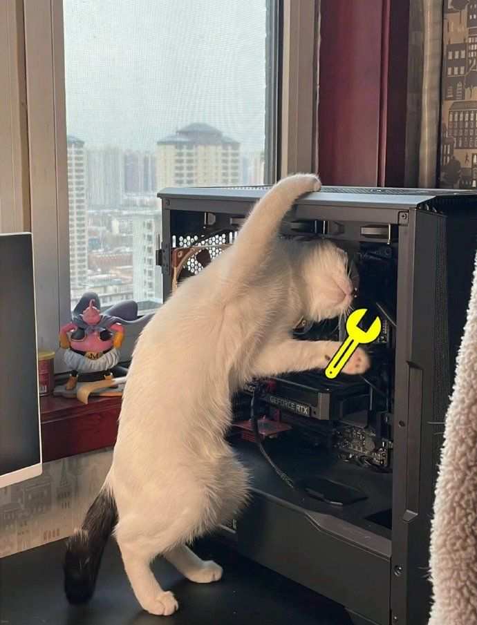

  <h1>Hi, I'm Nguyen Thanh Tai 👋</h1>
  <h3>Front-End Developer • Software Engineering Student</h3>
  
  
  
    
  
  
    
  
  
  
    
  
  
  
  
    
  

## 🎮 Profile

**Activity**
- 💻 **Coding**
- 🌱 **Learning**
- ☕ **Drinking coffee**

**Bio**
> Building beautiful interfaces and useful products.

 

## 👤 About Me

> 🎓 **Software Engineering Student** at FPT University
> 
> 💻 Passionate about **Web Development and UI/UX**
> 
> 🚀 Focus on **Front-End Development**
> 
> 📚 Learning **Laravel, Flutter, Next.js** and **AI technologies**
> 
> ✨ Love building **useful products**

 

  <i>"Small steps make big progress ✨"</i>

 

## 🛠️ Skills

**🎨 Frontend**  
 

 

**⚙️ Backend**  
 

 

**📱 Mobile**  
 

 

**🔧 Tools**  
 

  

## 📂 Current Projects

**🚀 ThuVienCode**
> Platform for sharing and selling source code.
>  

**⚽ Haxball Tools**
> Tools and utilities for Haxball communities.
>  

**🌐 Personal Portfolio**
> My personal developer portfolio website.
>  

**🟣 Mì studio**
> Website development service.
>  

**🛡️ Mì Sentinel**
> Discord security bot.
>  

**📚 Deutsch B1 App**
> German learning platform.
>  

 

## 🏷️ Interests

  
  
  
  
  
  
  

 

## 🌍 Languages

- **🇻🇳 Vietnamese:** Native `██████████` 100%
- **🇬🇧 English:** B1 `█████░░░░░` 50%
- **🇩🇪 Deutsch:** B1 `█████░░░░░` 50%

 

## 📊 GitHub Stats

  
  
   
  

 

  
    
  <b>"Thanks for visiting my profile ✨"</b>
    
  Designed by Nguyen Thanh Tai

