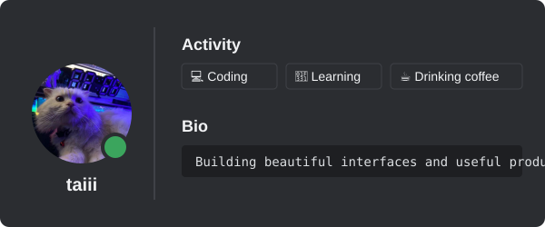
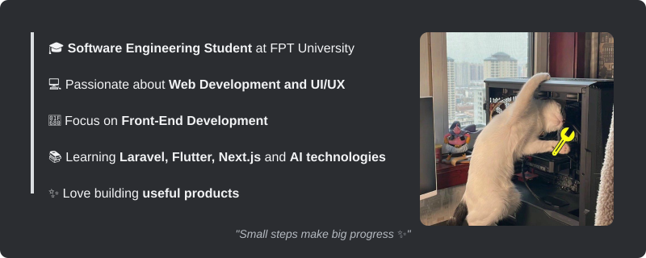

  <h1>Hi, I'm Nguyen Thanh Tai 👋</h1>
  <h3>Front-End Developer • Software Engineering Student</h3>
  
  
  
   
  
  
   
  
  
    
  
  
  
  
    
  

## 🎮 Profile

  

## 👤 About Me

  

## 🛠️ Skills

<table width="100%">
  <tr>
    <td width="25%" valign="top">
      <h3>🎨 Frontend</h3>
       
       
       
       
       
       
      
    </td>
    <td width="25%" valign="top">
      <h3>⚙️ Backend</h3>
       
       
       
       
      
    </td>
    <td width="25%" valign="top">
      <h3>📱 Mobile</h3>
       
      
    </td>
    <td width="25%" valign="top">
      <h3>🔧 Tools</h3>
       
       
       
      
    </td>
  </tr>
</table>

## 📂 Current Projects

<table width="100%">
  <tr>
    <td width="50%" valign="top">
      <blockquote>
        <h3>🚀 ThuVienCode</h3>
        
Platform for sharing and selling source code.

        
      </blockquote>
    </td>
    <td width="50%" valign="top">
      <blockquote>
        <h3>⚽ Haxball Tools</h3>
        
Tools and utilities for Haxball communities.

        
      </blockquote>
    </td>
  </tr>
  <tr>
    <td width="50%" valign="top">
      <blockquote>
        <h3>🌐 Personal Portfolio</h3>
        
My personal developer portfolio website.

        
      </blockquote>
    </td>
    <td width="50%" valign="top">
      <blockquote>
        <h3>🟣 Mì studio</h3>
        
Website development service.

        
      </blockquote>
    </td>
  </tr>
  <tr>
    <td width="50%" valign="top">
      <blockquote>
        <h3>🛡️ Mì Sentinel</h3>
        
Discord security bot.

        
      </blockquote>
    </td>
    <td width="50%" valign="top">
      <blockquote>
        <h3>📚 Deutsch B1 App</h3>
        
German learning platform.

        
      </blockquote>
    </td>
  </tr>
</table>

## 🏷️ Interests

  
  
  
  
  
  
  

## 🌍 Languages

<table width="100%">
  <tr>
    <td width="33%" align="center">
      <h3>🇻🇳 Vietnamese</h3>
      
        
      <code>██████████ 100%</code>
    </td>
    <td width="33%" align="center">
      <h3>🇬🇧 English</h3>
      
        
      <code>█████░░░░░ 50%</code>
    </td>
    <td width="33%" align="center">
      <h3>🇩🇪 Deutsch</h3>
      
        
      <code>█████░░░░░ 50%</code>
    </td>
  </tr>
</table>

## 📊 GitHub Stats

<table width="100%">
  <tr>
    <td width="50%" align="center">
      
    </td>
    <td width="50%" align="center">
      
    </td>
  </tr>
  <tr>
    <td colspan="2" align="center">
      
    </td>
  </tr>
</table>

 

  
    
  <b>"Thanks for visiting my profile ✨"</b>
    
  Designed by Nguyen Thanh Tai

